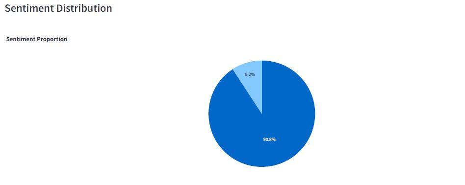
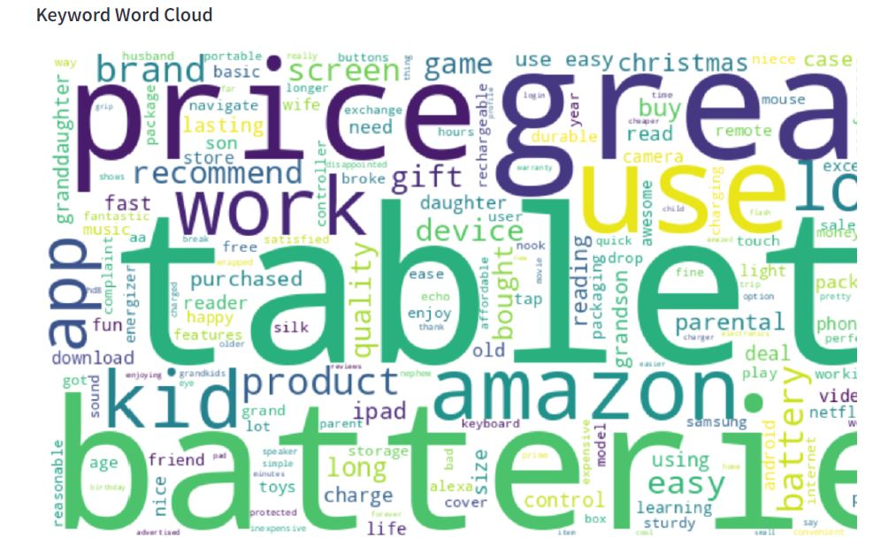
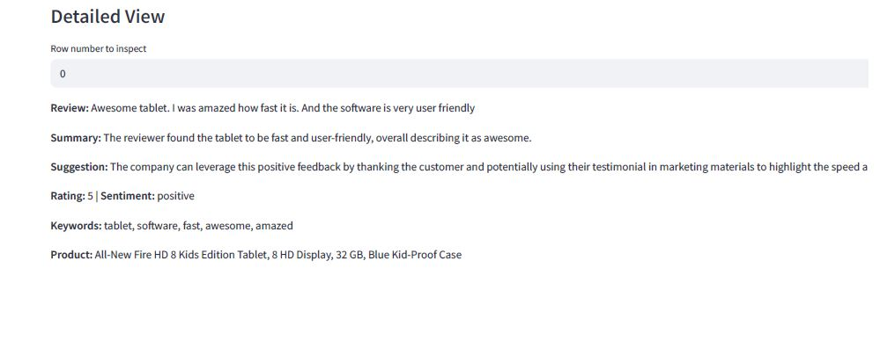

#  AI-Powered Feedback Analysis Dashboard

_A comprehensive solution for extracting actionable insights from customer reviews using state-of-the-art NLP techniques._

---

## Table of Contents

- [Overview](#overview)
- [Features](#features)
- [Project Structure](#project-structure)
- [Installation](#installation)
- [Usage](#usage)
- [How It Works](#how-it-works)
- [Dashboard Screenshots](#dashboard-screenshots)
- [Model Details](#model-details)
- [Customization](#customization)
- [Limitations](#limitations)
- [Contributing](#contributing)
- [License](#license)

---

## 🚀 Overview

**AI-Powered Feedback Analysis** is a ready-for-production, plugin-based data science project for large-scale analysis of customer reviews.

- Sentiment analysis
- Keyword extraction
- Automated summarization
- Actionable suggestion generation

and displays insights in an interactive Streamlit dashboard for business, product, and data teams.


---

## ✨ Features

| Feature                       | Description                                                                 |
|-------------------------------|-----------------------------------------------------------------------------|
|  **Sentiment Analysis**      | Classifies reviews as positive, negative, or neutral                         |
|  **Keyword Extraction**     | Extracts top keywords for each review/product                                 |
|  **Summarization**          | Automatically summarizes long reviews                                         |
|  **Smart Suggestions**       | Generates actionable suggestions using LLMs                                  |
|  **Interactive Dashboard**   | Powerful filtering, search, and visual analytics (Plotly/Matplotlib/WordCloud)|
|  **Modular Pipeline**        | Reusable, extendable Python modules and functions                            |

---

## Project Structure

# Project Structure

- ai_feedback_analysis/
    - data/
    - src/
        - config.py
        - data_loader.py
        - preprocessing.py
        - sentiment.py
        - keywords.py
        - summarizer.py
        - suggestions.py
        - dashboard.py
        - ...
    - main.py
    - requirements.txt
    - README.md
---

## 🛠 Installation

1. **Clone the repository**
    ```bash
    git clone https://github.com/<your-username>/ai_feedback_analysis.git
    cd ai_feedback_analysis
    ```

2. **Create and activate a virtual environment**
    ```bash
    python3 -m venv my_venv
    source my_venv/bin/activate
    ```

3. **Install dependencies**
    ```bash
    pip install -r requirements.txt
    ```

4. **(Optional) Set up OpenAI API key**
    - Create a `.env` file in the project root:
        ```bash
        echo "OPENAI_API_KEY=your-api-key-here" > .env
        ```
## Usage

1. **Prepare your data**
    - Place your CSV file(s) in the `data/` directory.
    - Adjust the path in `src/config.py` if needed.

2. **Launch the Streamlit dashboard**
    ```bash
    streamlit run main.py
    ```

3. **Navigate the dashboard**
    - Use sidebar filters to explore reviews by product, rating, or sentiment.
    - View sentiment & keyword distributions, word clouds, and detailed suggestions.
    - Inspect and search individual reviews for actionable insights.

---

##  How It Works

1. **Data Loading & Preprocessing**
    - Cleans text (removes noise, lowercases, strips whitespace).
    - Normalizes ratings and handles missing data.

2. **NLP Analysis Pipeline**
    - `sentiment.py`: Uses DistilBERT (HuggingFace) or OpenAI models for sentiment prediction.
    - `keywords.py`: Extracts top keywords using KeyBERT or similar.
    - `summarizer.py`: Generates concise summaries with BART (HuggingFace) or GPT-3.5.
    - `suggestions.py`: Prompts LLMs for improvement suggestions, tailored by review content and sentiment.

3. **Interactive Visualization**
    - Plots sentiment distribution per product with Plotly:
      ```python
      import plotly.express as px
      fig = px.bar(sentiment_counts, x='name', y='count', color='sentiment')
      st.plotly_chart(fig)
      ```
    - Generates word clouds of extracted keywords.
    - Enables user-driven filtering and exploration.

---
##  Dashboard Screenshots

| Sentiment Distribution           | Keyword Word Cloud              | Review Details & Suggestions   |
|----------------------------------|---------------------------------|-------------------------------|
|  |  |   |


---
## Customization

- **Change the model:**  
  Edit `src/config.py` to switch HuggingFace models or API options.
- **Change the dashboard visuals:**  
  Update `src/dashboard.py` to add, remove, or modify charts and filters.
- **Scale up:**  
  Remove the `sample_size` parameter to process all data for larger analyses.


##  Model Details

- **Sentiment Model:**  
    - Default: `distilbert-base-uncased-finetuned-sst-2-english` (HuggingFace)
    - Optional: OpenAI GPT-3.5 (`openai` method, requires API key)
- **Summarization Model:**  
    - Default: `facebook/bart-large-cnn`
    - Optional: GPT-3.5 turbo
- **Keyword Extraction:**  
    - KeyBERT (using SBERT embeddings)

> **Hybrid Correction**  
> Ratings and model sentiment are cross-checked to reduce misclassification:
> $$
> \text{Expected sentiment} =
> \begin{cases}
> \text{positive}, & \text{if rating} \geq 4 \\
> \text{negative}, & \text{if rating} \leq 2 \\
> \text{neutral}, & \text{otherwise}
> \end{cases}
> $$
> If a review's predicted sentiment and its rating disagree, the pipeline can optionally override the sentiment using the rating.


## Customization

- **Change the model:**  
  Edit `src/config.py` to switch HuggingFace models or API options.
- **Change the dashboard visuals:**  
  Update `src/dashboard.py` to add, remove, or modify charts and filters.
- **Scale up:**  
  Remove the `sample_size` parameter to process all data for larger analyses.


## Limitations

- **OpenAI features require a valid API key and may incur costs.**
- Model predictions are not 100% accurate and can be biased by review content.
- Dashboard may be slow for very large datasets or on limited hardware (consider batching or sampling).

---

## Contributing

Contributions, issues, and feature requests are welcome!
- Fork the repository
- Create a new branch (`git checkout -b feature/my-feature`)
- Commit your changes
- Open a Pull Request

---

> *AI-Powered Feedback Analysis Dashboard — built with ❤️ by Eren and the open-source community.*
